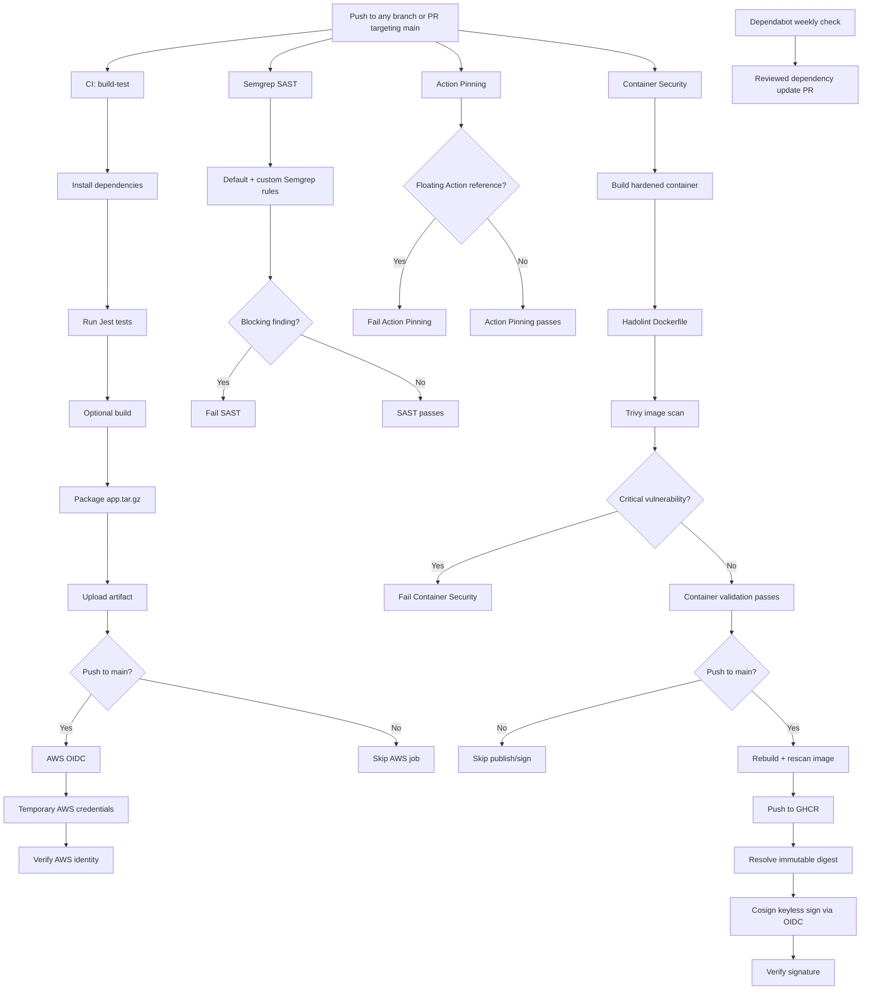

# CI/CD and DevSecOps Pipeline Architecture

This repository contains a GitHub Actions CI/CD and DevSecOps pipeline for a Node.js application. The pipeline builds, tests, packages, performs static application security testing, enforces GitHub Actions supply-chain controls, builds and scans a hardened container image, publishes approved images to GitHub Container Registry (GHCR), and signs and verifies published container images with Cosign. It also verifies AWS authentication using GitHub OIDC without storing long-lived AWS credentials.

The pipeline was developed incrementally. The initial CI foundation established automated testing, packaging, artifact retention, branch protection, least-privilege GitHub token permissions, and AWS OIDC authentication. Static Application Security Testing (SAST) was then added with Semgrep as an independent security gate. GitHub Actions supply-chain controls were added to reduce the risk of poisoned or unexpectedly changed workflow dependencies. Lab 6 extended the design into container security with a multi-stage Distroless runtime, non-root execution, Hadolint, Trivy image gating, GHCR publication, and keyless Cosign signing and verification.

---

## CI Pipeline Architecture

The workflow in `.github/workflows/ci.yml` runs on every push to any branch and on pull requests targeting `main`.

The `build-test` job:

1. Checks out the repository.
2. Sets up Node.js 24.
3. Installs dependencies with `npm ci`.
4. Runs Jest tests.
5. Invokes `npm run build --if-present`.
6. Packages the application as `app.tar.gz`.
7. Uploads the package as a GitHub Actions artifact.

This application uses plain JavaScript and currently has no build script, so the build command skips compilation.

Artifacts are named using the commit SHA and retained for 14 days.

The `aws-oidc` job runs after `build-test` succeeds and only for pushes to `main`. It exchanges a GitHub OIDC token for temporary AWS credentials and runs:

```bash
aws sts get-caller-identity
```

to verify authentication.

The AWS job currently demonstrates secure AWS identity federation only. It does not deploy or host the application.

The AWS trust policy requires the expected audience and the exact GitHub repository identity, including numeric owner and repository IDs, on the `main` branch.

---

## Container Security (Lab 6)

Lab 6 extended the pipeline from source and dependency controls into container build, runtime, registry, and provenance controls. The implementation is centered on:

```text
Dockerfile
.dockerignore
.github/workflows/container-security.yml
```

### Lab 6 Summary

| Control | Implementation | Validation |
|---|---|---|
| Minimal runtime | Multi-stage build using `node:24-bookworm-slim` for dependency installation and `gcr.io/distroless/nodejs24-debian13:nonroot` for runtime | Hardened image starts successfully and serves `/health` |
| Non-root execution | Explicit numeric runtime identity `USER 65532` | Satisfies Semgrep's explicit `USER` requirement and avoids Hadolint's named-user warning |
| Restricted runtime | Container tested with `--read-only`, `--cap-drop=ALL`, and `--security-opt=no-new-privileges:true` | `/health` continued to return `{"status":"ok"}` |
| Build-context reduction | `.dockerignore` excludes dependencies, Git metadata, workflows, coverage, environment files, logs, SBOM output, archives, and the baseline Dockerfile | Smaller, cleaner Docker build context |
| Dockerfile linting | Hadolint runs in the Container Security workflow | Final Dockerfile passes Hadolint |
| Image vulnerability gate | Trivy scans the built image with `--severity CRITICAL --exit-code 1` | 0 Critical and 0 High vulnerabilities in the validated hardened image |
| Image-size reduction | Baseline image: 415 MB; hardened image: 56.3 MB | 86.4% reduction; approximately 7.4 times smaller |
| Controlled publication | Image publication occurs only after container validation succeeds on a push to `main` | Pull requests and feature branches do not publish images |
| Image signing | Cosign keyless signing uses GitHub OIDC | No long-lived signing key is stored |
| Signature verification | The immutable image digest is verified against the exact repository workflow identity | Separate verification step passes after signing |

### Hardened Dockerfile

The final Dockerfile uses a two-stage design:

```dockerfile
# Stage 1: install production dependencies
FROM node:24-bookworm-slim AS deps

WORKDIR /app
COPY package*.json ./
RUN npm ci --omit=dev && npm cache clean --force

# Stage 2: minimal runtime image
FROM gcr.io/distroless/nodejs24-debian13:nonroot AS runtime

WORKDIR /app
COPY --from=deps /app/node_modules ./node_modules
COPY index.js ./

USER 65532

EXPOSE 3000
CMD ["index.js"]
```

Only production dependencies are copied into the runtime stage. Development dependencies such as test tooling are not included in the final image.

The Distroless runtime removes the normal interactive shell and most general-purpose operating-system utilities. This reduces attack surface, but it also changes the debugging model: application logs and purpose-built debug images are preferred over opening an interactive shell inside the production image.

### Runtime Hardening Validation

The hardened image was tested locally with:

```bash
docker run --rm   --read-only   --cap-drop=ALL   --security-opt=no-new-privileges:true   -p 3001:3000   my-app:after
```

The application remained functional and the health endpoint returned:

```json
{"status":"ok"}
```

The read-only root filesystem and capability restrictions are runtime controls rather than Dockerfile instructions. The Dockerfile establishes the non-root runtime identity, while the deployment or container-run configuration applies the additional restrictions.

### Before and After Image Size

| Image | Content Size | Disk Usage |
|---|---:|---:|
| `my-app:before` | 415 MB | 1.66 GB |
| `my-app:after` | 56.3 MB | 225 MB |
| Reduction | **86.4%** | **86.4%** |

The baseline image was created before hardening so the assignment had a reproducible before/after comparison. The hardened image is approximately 7.4 times smaller by content size.

### Hadolint

Hadolint is executed against the Dockerfile in the Container Security workflow.

During development, the Dockerfile initially used:

```dockerfile
USER nonroot
```

Semgrep correctly stopped flagging the Dockerfile as lacking a `USER` instruction, but Hadolint produced informational rule `DL3066` because a named user may not be resolvable by the host system. The final Dockerfile therefore uses:

```dockerfile
USER 65532
```

This preserves the Distroless non-root identity while making the runtime identity explicit and numeric.

### Trivy Image Scanning

The image-security gate uses:

```bash
trivy image   --scanners vuln   --severity CRITICAL   --exit-code 1   <image>
```

The validated hardened image produced:

- Critical: 0
- High: 0
- Medium: 23
- Low: 8

The 31 lower-severity operating-system findings remain visible for review, but the Lab 6 enforcement threshold is Critical severity. `--exit-code 1` makes a Critical finding fail the job instead of merely reporting it.

This image scan complements the repository-level dependency scanning performed elsewhere in the pipeline: `trivy fs` evaluates source/dependency manifests, while `trivy image` evaluates the assembled container, including operating-system packages in the runtime image.

### GHCR Publication, Cosign Signing, and Verification

The `container-security` job runs on pushes and pull requests with read-only repository access. It builds the hardened image, runs Hadolint, and enforces the Trivy Critical-vulnerability gate.

A second job, `publish-sign`, depends on successful container validation and runs only when the event is a push to `main`. It:

1. rebuilds the approved image using the commit SHA as the tag;
2. scans the image again before publication;
3. authenticates to GHCR using the workflow's `GITHUB_TOKEN`;
4. pushes the image;
5. resolves the immutable `sha256` image digest;
6. installs Cosign from a SHA-pinned GitHub Action;
7. signs the immutable digest using GitHub OIDC; and
8. verifies the resulting signature in a separate step.

The verification step checks both the GitHub OIDC issuer and the exact workflow identity:

```text
https://github.com/${GITHUB_REPOSITORY}/.github/workflows/container-security.yml@refs/heads/main
```

Signing the digest rather than only a mutable tag binds the signature to the exact image contents.

---

## Static Application Security Testing

Static Application Security Testing was added using Semgrep.

A separate workflow is stored at:

```text
.github/workflows/sast.yml
```

The SAST workflow runs on both pushes and pull requests.

Its primary scan command is:

```bash
semgrep --config auto --config .semgrep/custom-rules.yml --error .
```

This combines Semgrep's automatically selected rules with project-specific rules stored in:

```text
.semgrep/custom-rules.yml
```

The `--error` option turns Semgrep into a pipeline security gate. If a blocking finding is detected, Semgrep returns a non-zero exit code and the GitHub Actions SAST job fails.

This means security findings are not simply informational; they can prevent a pipeline run from succeeding.

---

## Initial SAST Findings and Triage

The initial Semgrep scan produced seven blocking findings.

| Finding | Location | Verdict | Action Taken |
|---|---|---|---|
| Mutable `actions/checkout@v4` | `.github/workflows/ci.yml` | True Positive | Pinned action to a full commit SHA |
| Mutable `actions/setup-node@v4` | `.github/workflows/ci.yml` | True Positive | Pinned action to a full commit SHA |
| Mutable `actions/upload-artifact@v4` | `.github/workflows/ci.yml` | True Positive | Pinned action to a full commit SHA |
| Mutable `actions/github-script@v7` | `.github/workflows/ci.yml` | True Positive | Pinned action to a full commit SHA |
| Mutable `aws-actions/configure-aws-credentials@v4` | `.github/workflows/ci.yml` | True Positive | Pinned action to a full commit SHA |
| Mutable `actions/checkout@v4` | `.github/workflows/sast.yml` | True Positive | Pinned action to a full commit SHA |
| Missing Express CSRF middleware | `index.js` | False Positive / Not Applicable | Reviewed application context and added a rule-specific suppression |

The GitHub Actions findings were treated as true positives because tags such as `@v4` are mutable and can be repointed. Each action was therefore pinned to a full 40-character commit SHA.

For example:

```yaml
uses: actions/checkout@11d5960a326750d5838078e36cf38b85af677262 # v4
```

This keeps the workflow tied to a specific action revision while the comment preserves the intended major version for readability.

The Express CSRF finding was classified as not applicable to the current application. The application currently exposes only a `GET /health` endpoint and does not use authentication, cookies, sessions, forms, or state-changing browser requests. Because there is no authenticated state-changing request for an attacker to forge, CSRF middleware would not currently mitigate an existing attack path.

A rule-specific `nosemgrep` suppression was added only after this triage decision was made.

---

## Custom Semgrep Rule

A custom Semgrep rule was added to detect direct use of Node.js `child_process.exec()`.

The rule is stored in:

```text
.semgrep/custom-rules.yml
```

The rule is:

```yaml
rules:
  - id: no-child-process-exec
    pattern: require("child_process").exec(...)
    message: >
      Avoid child_process.exec() because it invokes a shell and can create
      command-injection risk if untrusted input reaches the command.
      Prefer safer APIs such as execFile() or spawn() with separated arguments.
    languages:
      - javascript
    severity: ERROR
```

The purpose of this rule is to identify shell execution that could become vulnerable to command injection if untrusted input reaches the command.

---

## Custom Rule Validation

The custom rule was first tested locally.

An intentional violation was temporarily added:

```javascript
require("child_process").exec("echo semgrep-test");
```

Semgrep detected the custom finding:

```text
semgrep.no-child-process-exec
```

and classified it as blocking.

The intentional violation was then pushed so the automated GitHub Actions SAST workflow could evaluate it.

The SAST job failed, demonstrating that the custom rule was successfully integrated into the CI security gate.

The test line was then removed. The subsequent Semgrep scan and GitHub Actions run passed.

This created a complete security-gate validation cycle:

```text
Custom rule added
        |
        v
Clean scan passes
        |
        v
Intentional violation introduced
        |
        v
Semgrep detects violation
        |
        v
SAST workflow fails
        |
        v
Violation removed
        |
        v
SAST workflow passes
```

---

## GitHub Actions Supply-Chain Hardening

GitHub Actions are treated as software dependencies rather than trusted configuration.

All external Actions used by this repository are pinned to full 40-character commit SHAs instead of mutable references such as `@main`, `@master`, or major-version tags such as `@v4`.

Before updating an Action pin, the intended release tag is resolved and compared with the commit SHA that will be recorded in the workflow.

For example:

```bash
git ls-remote https://github.com/actions/checkout.git refs/tags/v4
```

The returned commit SHA is reviewed before the workflow reference is updated.

Pinning prevents a mutable tag from being silently repointed after the dependency has been reviewed. Pinning alone does not establish that an Action is trustworthy, so Action updates should also be reviewed for release notes, source changes, requested permissions, and changes in execution behavior.

### Dependabot

Dependabot is configured in:

```text
.github/dependabot.yml
```

to monitor GitHub Actions dependencies and propose updates through pull requests.

GitHub Actions updates are checked weekly.

A 7-day cooldown is configured for newly published versions before routine update PRs are proposed. This provides an observation period for newly released dependencies while keeping updates reviewable through the normal pull-request process.

Dependabot PRs are not automatically merged.

### Action Pinning Enforcement

A separate workflow in:

```text
.github/workflows/action-pinning.yml
```

checks GitHub Actions workflow files for common floating Action references such as:

```text
@main
@master
@v4
```

If one of these references is detected, the workflow exits with a non-zero status.

This check supplements Semgrep. It is intentionally simple and acts as an additional policy-enforcement layer rather than a full YAML security parser.

### Action Pinning Validation

The Action Pinning control was tested by temporarily replacing an approved full commit SHA with:

```yaml
uses: actions/checkout@v4
```

The test caused both the Action Pinning workflow and the Semgrep SAST workflow to fail.

The full SHA was then restored and the workflows returned to a passing state.

This demonstrated that mutable GitHub Action references are detected by multiple independent controls.

### Defense in Depth

The GitHub Actions dependency controls now include:

```text
Pinned full commit SHAs
        |
        +--> Dependabot update proposals
        |
        +--> 7-day update cooldown
        |
        +--> Action Pinning enforcement
        |
        +--> Semgrep validation
        |
        +--> Pull-request review
```

No individual control is treated as sufficient by itself.

Lab 6 follows the same policy. The Cosign installer used by the container-signing job is pinned to a full commit SHA rather than a mutable major-version tag. This keeps the new container-provenance control consistent with the repository's existing GitHub Actions supply-chain policy.

---

## Overall Pipeline Architecture



The CI, SAST, Action Pinning, and Container Security workflows are intentionally separated so each control has a clear responsibility and failure boundary. Container publication and signing are deliberately downstream of successful container validation and are restricted to pushes to `main`.

---

## Permissions and Access

The CI workflow defaults to:

```yaml
permissions:
  contents: read
```

Only the AWS OIDC job receives:

```yaml
permissions:
  contents: read
  id-token: write
```

The additional `id-token: write` permission allows GitHub Actions to request an OIDC token for temporary AWS authentication. No long-lived AWS access keys are configured in the workflow, and no S3 permissions were added because the current AWS job only verifies identity.

The SAST and Action Pinning workflows use read-only repository access.

The Container Security workflow also defaults to:

```yaml
permissions:
  contents: read
```

Its validation job therefore cannot publish packages or request OIDC tokens.

Only the `publish-sign` job, which runs after successful container validation and only on pushes to `main`, receives:

```yaml
permissions:
  contents: read
  packages: write
  id-token: write
```

`packages: write` is required to publish the approved image to GHCR. `id-token: write` is required for Cosign keyless signing through GitHub OIDC. Pull-request and feature-branch runs do not receive these elevated permissions because the publishing job is skipped outside `main`.

No long-lived Cosign private key is stored in the repository or GitHub Secrets.

---

## Packaging

The application archive created by the CI workflow excludes:

- `node_modules`
- `.git`
- `.github`
- coverage output
- `.env`
- `.env.*`
- `.npmrc`

The resulting archive contains the source code and dependency manifests.

Runtime dependencies can be restored after extraction with:

```bash
npm ci --omit=dev
```

These exclusions reduce unnecessary package contents and omit common credential-file locations, but they do not replace secret scanning or other security controls.

Container builds use a separate `.dockerignore` to reduce the Docker build context. It excludes:

- `node_modules/`
- `.git/`
- `.github/`
- `coverage/`
- `.env` and `.env.*`, except `.env.example`
- `npm-debug.log*`
- `sbom.json`
- `*.tar.gz`
- `Dockerfile.before`

The container runtime stage installs or receives only production dependencies. This reduces image size and avoids shipping test-only tooling in the production image.

---

## Branch Protection

Branch protection requires pull requests and passing required status checks before changes can enter `main`.

The required checks include:

- `build-test`
- `Semgrep SAST`

The Action Pinning check is intended to become an additional required branch-protection status check once the supply-chain hardening changes are merged and validated on `main`.

Required approvals are disabled under the assignment's solo-student exception, so independent review is not currently enforced.

Administrator bypass protection is enabled using:

```text
Do not allow bypassing the above settings
```

This means branch protection also applies to administrators.

Because `Semgrep SAST` is a required status check, a pull request cannot be merged into `main` while the SAST job is failing. The same enforcement model can be applied to Action Pinning so workflow dependency policy becomes a merge gate rather than an informational check.

The Container Security workflow runs on pull requests as well as pushes, so Dockerfile linting and the Trivy Critical-vulnerability gate are evaluated before merge. The separate `Publish, Sign, Verify` job is intentionally skipped on pull requests and feature branches; it runs only after validated changes reach `main`. If desired, the Container Security validation job can also be added to the repository's required status checks.

---

## Issues Encountered and Solutions

| Issue Encountered | Cause | Solution or Outcome |
|---|---|---|
| AWS command referenced a JSON file on the Windows computer | CloudShell could not access the local `C:\` drive | Uploaded `trust-policy.json` to CloudShell and referenced it with `file://trust-policy.json` |
| Could not return to the CloudShell prompt after viewing output | AWS CLI displayed output in a pager | Used `q` to exit and `--no-cli-pager` in later commands |
| Uncertainty about attaching `AmazonS3ReadOnlyAccess` | The example granted S3 access even though the workflow only verified identity | Omitted unnecessary S3 permissions |
| CI only ran on pushes to `main` | The push trigger included a branch filter | Removed the filter so all branch pushes trigger CI |
| Application was not being packaged | Initial workflow contained no packaging stage | Added creation of `app.tar.gz` |
| No downloadable application artifact | Package disappeared when the runner completed | Added `actions/upload-artifact` with 14-day retention |
| AWS OIDC checks appeared skipped | AWS job was intentionally restricted to pushes to `main` | Merged the PR into `main`; feature branch skips are expected |
| AWS returned `Not authorized to perform sts:AssumeRoleWithWebIdentity` | Actual OIDC subject contained numeric owner and repository IDs | Displayed only the subject and audience, then corrected the trust policy |
| Invalid YAML syntax in the CI workflow | Indentation became invalid while editing workflow steps | Replaced the affected block with consistently indented YAML using spaces |
| Invalid YAML syntax in the SAST workflow | Hidden or malformed whitespace prevented GitHub from creating the SAST job | Replaced the workflow with clean, consistently indented YAML and confirmed successful runs |
| Needed least-privilege GitHub permissions | OIDC required permission beyond repository read access | Kept `contents: read` globally and granted `id-token: write` only to the AWS job |
| Required PR approval conflicted with solo work | Independent reviewer was unavailable | Used the assignment's solo-student exception while retaining required PRs and status checks |
| Build step passed without compiling | `package.json` has no `build` script | Documented that `npm run build --if-present` skips compilation |
| Semgrep found issues but local scan still returned success | Baseline scan did not include `--error` | Added `--error` to convert findings into a failing security gate |
| `semgrep ci` reported findings but exited successfully | Semgrep Cloud policy classified the findings as non-blocking | Used `semgrep --config ... --error` for deterministic lab gating |
| GitHub Actions triggered Semgrep findings | Actions used mutable tags such as `@v4` | Pinned actions to exact 40-character commit SHAs |
| SAST workflow flagged its own checkout action | `sast.yml` also used `actions/checkout@v4` | Pinned the SAST workflow action to the same immutable SHA |
| Express was flagged for missing CSRF middleware | Generic rule saw Express without CSRF protection | Reviewed the application's actual routes and documented the finding as not applicable |
| Needed to prove the custom rule worked | Existing code did not violate the new rule | Added a temporary `child_process.exec()` call and confirmed the SAST job failed |
| Local Semgrep ran more rules than GitHub Actions | Local Semgrep installation was authenticated and had additional capabilities | Used the lab-defined configuration in CI and documented the difference |
| Semgrep blocked the initial Dependabot configuration | The GitHub Actions update configuration did not define an explicit cooldown period | Added `cooldown: default-days: 7` so routine newly published Action updates are delayed before Dependabot proposes them |
| Needed to verify Action Pinning enforcement | The new policy had not yet been tested against an actual floating Action reference | Temporarily changed a pinned Action to `@v4`; both Action Pinning and SAST failed, then passed after the SHA was restored |
| No existing Dockerfile was available for a before/after comparison | The Lab 6 instructions assumed the application already had a container definition | Created and validated a simple baseline Node 24 image first, recorded its size, then replaced it with the hardened multi-stage Dockerfile |
| Docker could not bind host port 3000 or 3001 | Juice Shop or a previous `my-app` container was already listening on the requested host port | Used an alternate host port and stopped stale containers identified with `docker ps` |
| Docker Hub image pull failed with OAuth/EOF network errors | Docker Desktop's registry/network path temporarily failed even though Windows could reach `auth.docker.io` | Restarted the Docker/WSL networking state and retried the pull successfully |
| Semgrep flagged the Dockerfile for a missing `USER` | The Distroless `:nonroot` tag was secure at runtime, but the static rule required an explicit Dockerfile `USER` instruction | Added an explicit runtime `USER` directive |
| Hadolint reported `DL3066` for `USER nonroot` | A named user may not be resolvable consistently by the host/runtime | Replaced the named user with numeric UID `65532`, preserving non-root execution while satisfying the lint rule |
| Needed to prove the hardened image still worked under runtime restrictions | A smaller or non-root image is not sufficient if the application breaks under the intended controls | Ran the image with a read-only root filesystem, all capabilities dropped, and `no-new-privileges`; `/health` still returned `{"status":"ok"}` |
| Trivy reported 31 vulnerabilities in the hardened image | The Distroless Debian runtime still contains a small set of OS libraries with Low/Medium findings | Kept findings visible for review; the assignment gate correctly passed because there were 0 High and 0 Critical findings |
| Signing should not occur on untrusted PR execution | The original example granted package-write and OIDC permissions broadly | Split validation from publication; only the post-validation `publish-sign` job on `main` receives `packages: write` and `id-token: write` |
| Needed to avoid signing only a mutable image tag | Tags can be moved to different image content | Resolved the registry digest after push and signed/verified the immutable `sha256` image reference |

---

## Changes from the Assignment Examples and Improvements

| Area | Assignment Example or Initial Setup | Change or Improvement | Benefit |
|---|---|---|---|
| CI triggers | Pushes initially focused on `main` | Enabled pushes to every branch and PRs targeting `main` | Detects problems earlier |
| Packaging | No package stage | Added creation and upload of `app.tar.gz` | Produces a retained application artifact for later use or deployment |
| Package contents | No explicit exclusions | Excluded dependencies, Git metadata, workflows, coverage, environment files, and `.npmrc` | Reduces unnecessary and potentially sensitive content |
| Artifact tracking | No naming or retention strategy | Artifact name includes commit SHA and retention is 14 days | Connects artifacts to source revisions |
| GitHub token permissions | OIDC example granted elevated permission broadly | Granted `id-token: write` only to the AWS job | Reduces token privileges |
| Job ordering | AWS job could operate independently | Added `needs: build-test` | Cloud authentication occurs only after successful CI |
| AWS permissions | Example used S3 read access | Removed S3 permissions | Avoids access to unused AWS services |
| AWS trust policy | Initial policy used repository names | Restricted trust to actual OIDC identity and `main` | Narrows who can assume the AWS role |
| Action dependencies | Used mutable tags such as `@v4` | Pinned actions to exact commit SHAs | Reduces GitHub Actions supply-chain risk |
| Static analysis | No automated SAST | Added Semgrep workflow | Detects security problems automatically |
| SAST enforcement | Findings could be informational | Added `--error` | Makes security findings capable of failing CI |
| Finding management | No formal triage process | Classified findings as true positives or false positives | Encourages review rather than automatic suppression |
| Custom security policy | Only default scanner rules | Added project-specific `no-child-process-exec` rule | Enforces a project-specific secure coding expectation |
| Security validation | No deliberate negative test | Introduced and removed a known violation | Demonstrates that the security gate actually works |
| Solo PR workflow | Standard requirement assumed another reviewer | Applied solo-student exception | Preserves required PR/check workflow without impossible approval requirement |
| GitHub Actions dependency updates | Action SHAs had to be updated manually | Added Dependabot for GitHub Actions with weekly reviewed PRs | Keeps pinned dependencies maintainable without reverting to floating tags |
| Dependency update cooldown | Newly published Action updates could be proposed immediately | Added a 7-day cooldown for routine GitHub Actions version updates | Provides an observation period before newly released dependencies are proposed |
| Action reference enforcement | SHA pinning depended on manual review | Added an Action Pinning workflow that rejects common floating references | Prevents accidental reintroduction of mutable Action dependencies |
| SHA validation | A SHA could be copied without checking its release association | Added a documented release-tag-to-SHA validation process | Makes Action dependency approval more explicit and auditable |
| Supply-chain control validation | Pinning policy had not been deliberately challenged | Temporarily restored `actions/checkout@v4` and observed both SAST and Action Pinning fail | Demonstrates that independent controls detect a mutable workflow dependency |
| Node runtime | Earlier project configuration used Node.js 20 | Updated local/CI/container work to Node.js 24 | Keeps the application on a supported current runtime |
| Container build | No hardened container design | Added a multi-stage build with a slim dependency stage and Distroless runtime stage | Reduces runtime attack surface and image size |
| Runtime dependencies | Full development dependency tree could be included | Installed production dependencies with `npm ci --omit=dev` | Removes test-only packages from the production image |
| Runtime identity | Base-image behavior was implicit | Added explicit numeric `USER 65532` | Makes non-root execution auditable and scanner-friendly |
| Docker build context | No container-specific exclusions | Added `.dockerignore` | Reduces unnecessary files and accidental sensitive content in the build context |
| Runtime restrictions | Default writable filesystem and Linux capabilities | Validated `--read-only`, `--cap-drop=ALL`, and `no-new-privileges` | Reduces post-compromise capabilities |
| Dockerfile policy | No automated Dockerfile linting | Added Hadolint to the Container Security workflow | Detects Dockerfile security and maintainability issues automatically |
| Image vulnerability management | Filesystem scanning did not inspect the assembled runtime image | Added `trivy image` with `--severity CRITICAL --exit-code 1` | Turns Critical image vulnerabilities into a build gate |
| Container artifact size | Baseline image was 415 MB | Hardened image reduced to 56.3 MB | Reduces distribution cost and attack surface; 86.4% size reduction |
| Registry publication | No controlled container publication path | Publish to GHCR only after successful validation on `main` | Prevents unvalidated PR/feature-branch images from entering the release path |
| Signing credentials | A traditional signing approach could require stored private keys | Added Cosign keyless signing with GitHub OIDC | Eliminates long-lived signing-key storage |
| Signature target | Mutable tag could be signed | Resolve and sign the immutable image digest | Binds provenance to exact image contents |
| Signature verification | Signing alone does not prove the expected workflow identity | Added a separate Cosign verification step with exact certificate identity and issuer checks | Confirms the image was signed by the intended `main` workflow |

---

## Current Scope

The pipeline currently provides:

- automated dependency installation;
- Node.js 24 execution in CI;
- Jest tests;
- optional application build;
- application packaging;
- retained GitHub Actions artifacts;
- read-only default GitHub token permissions;
- SHA-pinned GitHub Actions;
- AWS authentication using GitHub OIDC;
- short-lived AWS credentials;
- branch protection;
- Semgrep SAST scanning;
- project-specific Semgrep rules;
- SAST enforced as a required branch-protection status check;
- blocking security gates;
- documented finding triage;
- automated GitHub Actions dependency update proposals through Dependabot;
- a 7-day dependency-update cooldown;
- Action Pinning enforcement for common floating GitHub Action references;
- a documented release-tag-to-SHA validation process;
- a hardened multi-stage Dockerfile;
- a Distroless Node.js 24 runtime;
- explicit non-root execution as UID `65532`;
- a reduced Docker build context through `.dockerignore`;
- validated read-only root filesystem operation;
- all Linux capabilities dropped during hardened runtime testing;
- `no-new-privileges` runtime validation;
- Hadolint Dockerfile linting;
- Trivy container-image vulnerability scanning;
- a Critical-vulnerability image gate using a non-zero exit code;
- an 86.4% container content-size reduction from 415 MB to 56.3 MB;
- controlled publication of validated images to GHCR;
- main-branch-only package-write and OIDC permissions for container publication/signing;
- immutable image-digest resolution after publication;
- Cosign keyless container signing using GitHub OIDC; and
- separate Cosign signature verification against the exact repository workflow identity.

The current design separates validation from privileged publication. Pull requests can exercise build, lint, static-analysis, policy, and container-vulnerability controls without receiving registry-write or signing permissions. Only validated pushes to `main` enter the image publication and provenance-signing path.

## AI Use Disclosure

AI assistance was used for troubleshooting, command verification, and drafting documentation. I executed, tested, reviewed, and validated the documentation, implementation, and resulting pipeline myself.
